# Activitat RA3 - PYTHON
## NOM I COGNOMS: Carlos Alberto Galan Delgado

### 7.9.3. Exercise
Write a function called uses_only that takes a word and a string of letters, and that returns True if the word contains only letters in the string. 

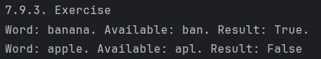

### 7.9.4. Exercise
Write a function called uses_all that takes a word and a string of letters, and that returns True if the word contains all of the letters in the string at least once. 

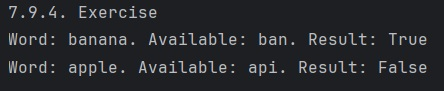

### 9.15.2. Exercise
Write a function called is_anagram that takes two strings and returns True if they are anagrams. 

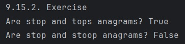

### 9.15.3. Exercise
Write a function called is_palindrome that takes a string argument and returns True if it is a palindrome and False otherwise. 

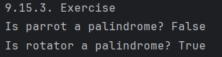

### 9.15.4. Exercise 
Write a function called reverse_sentence that takes as an argument a string that contains any number of words separated by spaces. It should return a new string that contains the same words in reverse order. 

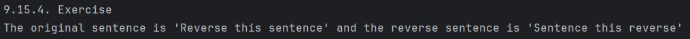

### 9.15.5. Exercise 
Write a function called total_length that takes a list of strings and returns the total length of the strings. 

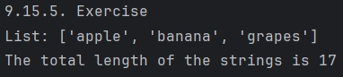

### 11.11.2. Exercise
Write a line of code that appends the value 6 to the end of the second list in t. If you display t, the result should be ([1, 2, 3], [4, 5, 6]).
Try to create a dictionary that maps from t to a string, and confirm that you get a TypeError.

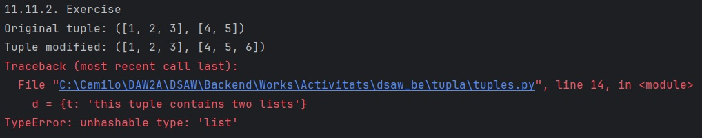

### 11.11.3. Exercise
Write a function called shift_word that takes as parameters a string and an integer, and returns a new string that contains the letters from the string shifted by the given number of places.

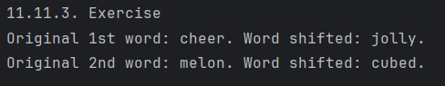

### 10.11.3. Exercise
Write a function named has_duplicates that takes a sequence – like a list or string – as a parameter and returns True if there is any element that appears in the sequence more than once.

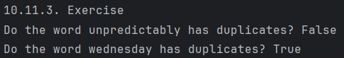

### 10.11.4. Exercise 
Write a function called find_repeats that takes a dictionary that maps from each key to a counter, like the result from value_counts. It should loop through the dictionary and return a list of keys that have counts greater than 1. You can use the following outline to get started.

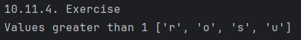

### 10.11.5. Exercise
Write a function called add_counters that takes two dictionaries like this and returns a new dictionary that contains all of the letters and the total number of times they appear in either word. 

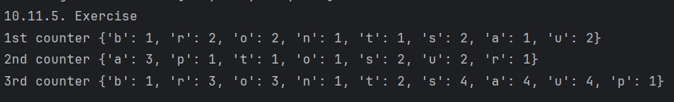
